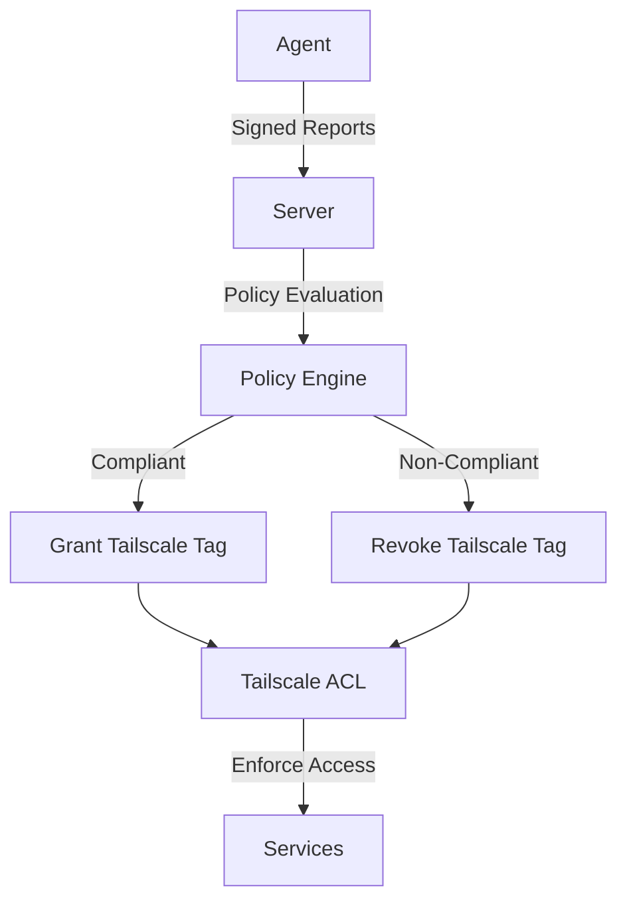

# Vouch

**Enterprise-grade device attestation for Tailscale networks - without the enterprise price tag**

Vouch continuously monitors device security posture (OS patches, firewall, encryption, Tailscale client health) and automatically enforces compliance via Tailscale ACLs. Build your own BeyondCorp-style zero-trust network.

## Why Vouch?

- 🔒 **Comprehensive security checks** - OS updates, firewall, disk encryption, Secure Boot, TPM, Tailscale client health
- 🎯 **Policy-driven** - Define custom compliance rules in YAML
- ⚡ **Lightweight** - <10MB agents, minimal CPU/memory overhead
- 🔐 **Cryptographically signed** - Ed25519-signed heartbeats with replay protection
- 🔌 **Tailscale-native** - Automatic ACL enforcement via API
- 🏠 **Self-hosted** - Full control, no SaaS required
- 🚀 **Auto-updating** - Agents can self-update with signature verification

## Features

### Device Posture Checks

✅ **Tailscale Client**
- Version tracking
- Auto-update status
- Release track (stable/beta)
- State encryption enabled

✅ **Operating System**
- Update recency (last patch time)
- Outstanding updates count
- Pending reboot detection
- Auto-update service status (unattended-upgrades, Windows Update)

✅ **Security**
- Disk encryption per volume (LUKS, BitLocker, FileVault)
- Secure Boot status
- TPM presence and version
- Firewall enabled and configured (ufw, iptables, nftables, Windows Defender)

✅ **Hardening** (optional)
- SELinux/AppArmor enforcing
- SSH password authentication disabled
- Kernel lockdown mode
- Anti-malware status (Windows Defender)

✅ **System Health**
- Tailscaled running and online
- Time synchronization (NTP drift detection)
- Network connectivity
- Service health

### Security Features

- **Ed25519 signed requests** - All agent reports cryptographically signed
- **Replay protection** - 5-minute request validity window with nonce
- **Identity binding** - Agent identity tied to Tailscale node ID
- **Secure credential storage** - Private keys stored with 0600 permissions
- **One-time enrollment tokens** - Prevent unauthorized agent registration

### Management

- **CLI tool** - View compliance status, manage devices
- **REST API** - Integration with existing tools
- **Tailscale ACL automation** - Automatic tag management
- **Flexible policies** - YAML-based rules, hot-reload capable
- **Remote configuration** - Optional policy overlay from server

## Quick Start

### Install Server

```bash
# Download latest release
wget https://github.com/haasonsaas/vouch/releases/latest/download/vouch-server-linux-amd64
chmod +x vouch-server-linux-amd64
sudo mv vouch-server-linux-amd64 /usr/local/bin/vouch-server

# Or use Docker
docker pull ghcr.io/haasonsaas/vouch-server:latest
docker run -d -p 8080:8080 \
  -v ./policies.yaml:/etc/vouch/policies.yaml \
  -v vouch-data:/var/lib/vouch \
  ghcr.io/haasonsaas/vouch-server:latest
```

### Install Agent

```bash
# One-line install
curl -fsSL https://raw.githubusercontent.com/haasonsaas/vouch/main/install.sh | sh

# Or manually
wget https://github.com/haasonsaas/vouch/releases/latest/download/vouch-agent-linux-amd64
chmod +x vouch-agent-linux-amd64
sudo mv vouch-agent-linux-amd64 /usr/local/bin/vouch-agent

# Enroll
sudo vouch-agent --enroll TOKEN_FROM_SERVER --server https://vouch.your-tailnet.ts.net

# Start service
sudo systemctl enable --now vouch-agent
```

### Check Status

```bash
# Download CLI
wget https://github.com/haasonsaas/vouch/releases/latest/download/vouch-linux-amd64
chmod +x vouch-linux-amd64
sudo mv vouch-linux-amd64 /usr/local/bin/vouch

# View compliance
vouch status
vouch devices
vouch device dev-desktop
```

## Configuration

### Example Policy

```yaml
# policies.yaml
rules:
  - name: require-recent-updates
    check: update_age_days < 30
    action: deny
    
  - name: require-firewall
    check: firewall_enabled == true
    action: deny
    
  - name: require-encryption
    check: disk_encrypted == true
    action: deny
    
  - name: require-secure-boot
    check: secure_boot_enabled == true
    action: warn
    
  - name: require-tailscale-auto-update
    check: tailscale_auto_update == true
    action: warn
```

### Agent Configuration

```yaml
# /etc/vouch/agent.yaml
server:
  url: https://vouch.your-tailnet.ts.net
  request_timeout_s: 10

auth:
  key_path: /var/lib/vouch/agent_key
  allow_key_rotation: true

reporting:
  interval_s: 300  # 5 minutes
  jitter_s: 30
  include_listening_services: false

checks:
  tailscale:
    enable: true
    localapi_socket: /var/run/tailscale/tailscaled.sock
  
  firewall:
    enable: true
    linux_prefer: "auto"  # ufw, iptables, nftables, auto
  
  updates:
    enable: true
    max_days_since_update: 30
  
  disk_encryption:
    enable: true
    require_root_volume: true
  
  secure_boot_tpm:
    enable: true
  
  antimalware:
    enable: true
    min_sig_recency_days: 7

health:
  time_drift_max_s: 120

logging:
  level: info  # debug, info, warn, error
  json: false

updates:
  self_update: false
  channel: stable
  verify_signature: true
```

## Use Cases

### Homelab Security
- Enforce patch compliance before accessing services
- Ensure firewall enabled on all devices
- Require disk encryption on laptops
- Monitor Tailscale client health

### Remote Work
- Verify employee device compliance
- Enforce security baselines (firewall, encryption, updates)
- Automatic compliance reporting
- Non-compliant device isolation

### ML Infrastructure
- Ensure GPU workstations meet security standards
- Verify Secure Boot + TPM on sensitive compute
- Track update status across fleet
- Enforce before granting training job access

### IoT Fleet Management
- Track firmware versions
- Monitor update compliance
- Detect configuration drift
- Automated remediation

## Architecture



**Agent** collects posture → **Server** evaluates policy → **Enforcement** updates Tailscale ACLs

## API

### Enrollment

```http
POST /v1/enroll
Content-Type: application/json

{
  "token": "one-time-token-123",
  "node_id": "n1234abcd",
  "hostname": "dev-laptop",
  "public_key": "base64-encoded-ed25519-public-key",
  "os_info": "linux/amd64"
}

Response:
{
  "agent_id": "agent-uuid",
  "server_version": "v0.1.0",
  "min_version": "v0.1.0",
  "policy_etag": "abc123"
}
```

### Report Posture

```http
POST /v1/report
Content-Type: application/json
X-Vouch-Agent-ID: agent-uuid
X-Vouch-Signature: ed25519-signature-base64
X-Vouch-Timestamp: 2024-10-20T02:00:00Z
X-Vouch-Nonce: random-nonce

{
  "hostname": "dev-laptop",
  "agent_version": "v0.1.0",
  "node_id": "n1234abcd",
  "tailscale": {
    "version": "1.56.0",
    "auto_update": true,
    "release_track": "stable",
    "state_encrypted": false,
    "online": true
  },
  "firewall": {
    "enabled": true,
    "type": "ufw",
    "default_policy": "deny"
  },
  "updates": {
    "auto_update_enabled": true,
    "last_update_time": "2024-10-15T10:00:00Z",
    "updates_outstanding": 0,
    "reboot_pending": false
  },
  "secure_boot": {
    "secure_boot_enabled": true,
    "tpm_present": true,
    "tpm_version": "2.0"
  }
}

Response:
{
  "status": "ok",
  "compliant": true,
  "violations": [],
  "min_version": "v0.1.0"
}
```

## Examples

See [`examples/`](examples/) for:

- **[Strict Policy](examples/policies/strict.yaml)** - Production security (7-day updates)
- **[Homelab Policy](examples/policies/homelab.yaml)** - Relaxed dev environment (60-day updates)
- **[ML Workstation Policy](examples/policies/ml-workstation.yaml)** - GPU workstation requirements
- **[Full Stack Docker Compose](examples/docker-compose/full-stack.yaml)** - Server + Grafana + Prometheus
- **[Systemd Service](examples/systemd/vouch-agent-dev-desktop.service)** - Agent service file

## Building from Source

```bash
git clone https://github.com/haasonsaas/vouch
cd vouch
make build

# Binaries in bin/
./bin/vouch-server --help
./bin/vouch-agent --help
./bin/vouch --help
```

## Security Model

1. **Enrollment** - Agent generates Ed25519 keypair, enrolls with one-time token
2. **Identity** - Agent identity bound to Tailscale node ID
3. **Signing** - Every report signed with private key, verified by server
4. **Replay protection** - 5-minute validity window, nonce tracking
5. **Enforcement** - Server updates Tailscale ACLs based on compliance

## Monitoring

Vouch exposes Prometheus metrics:

```yaml
# prometheus.yml
scrape_configs:
  - job_name: 'vouch'
    static_configs:
      - targets: ['vouch-server:8080']
```

**Metrics:**
- `vouch_devices_total` - Total enrolled devices
- `vouch_devices_compliant` - Compliant device count
- `vouch_policy_evaluations_total` - Policy checks performed
- `vouch_enforcement_actions_total` - ACL updates executed

## FAQ

**Q: How is this different from Tailscale Enterprise posture checks?**  
A: Vouch is self-hosted, open source, and fully customizable. You control the policies, data, and enforcement. Perfect for homelabs, small teams, or organizations wanting more control.

**Q: Does this work without Tailscale Enterprise?**  
A: Yes! Vouch works with regular Tailscale using the public API for ACL management.

**Q: Can I use this with existing MDM/EDR tools?**  
A: Yes, Vouch complements existing tools. Future versions will integrate with CrowdStrike, Jamf, Intune, etc.

**Q: What happens if an agent goes offline?**  
A: Server tracks last-seen time. You can configure policies to revoke access after N minutes of no contact.

**Q: How do I update policies without restarting?**  
A: Server hot-reloads safe policy changes. Critical auth/identity changes require restart.

## Roadmap

- [x] Core posture collection
- [x] Policy engine
- [x] Ed25519 signed requests
- [x] Tailscale integration
- [x] Comprehensive security checks
- [ ] Web UI dashboard
- [ ] Self-update with signature verification
- [ ] Windows agent support
- [ ] EDR/MDM integration
- [ ] Hardware attestation (TPM quotes)

## License

Apache 2.0 - See [LICENSE](LICENSE)

## Contributing

See [CONTRIBUTING.md](CONTRIBUTING.md)

## Status

**Alpha** - Core functionality complete, actively developed

---

Built for zero-trust homelabs and security-conscious teams.

**Repository**: https://github.com/haasonsaas/vouch  
**Latest Release**: https://github.com/haasonsaas/vouch/releases/latest
